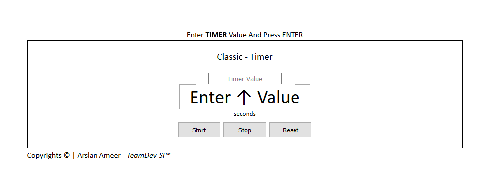

# Classic-JS-Timer
## A Simple Alarm Timer Made With HTML5, CSS & JS.

Basic Easy To Understand Timer Made with Pure HTML5, CSS & Javascript which takes User input in seconds to start the timer.

**TRY IT NOW**: [Basic-JS-Timer](https://arslanameer.github.io/Ui-Component-Classic-JS-Timer/)

_(Arslan Ameer)_
